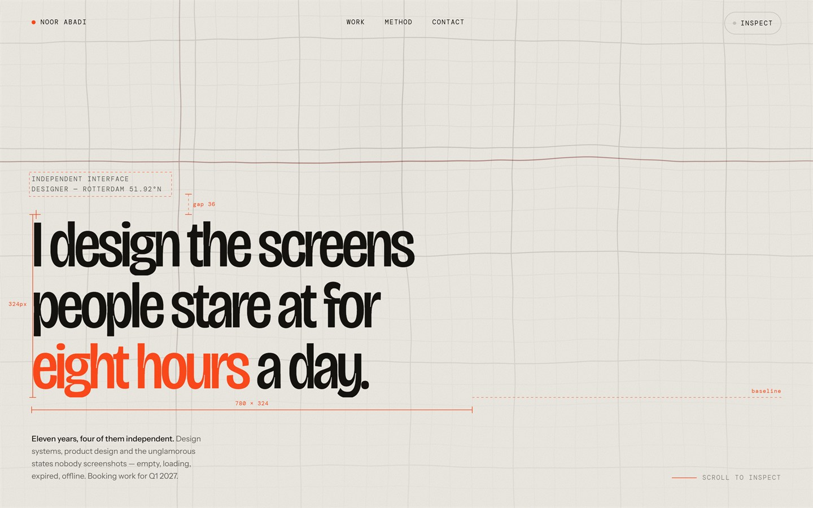
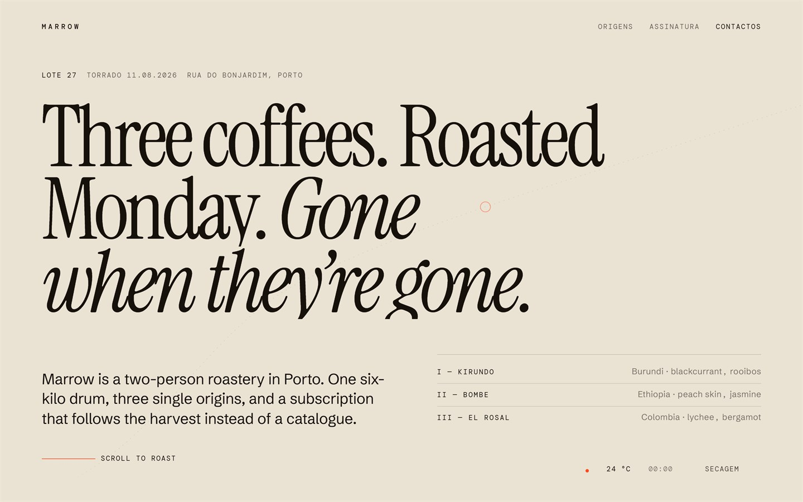
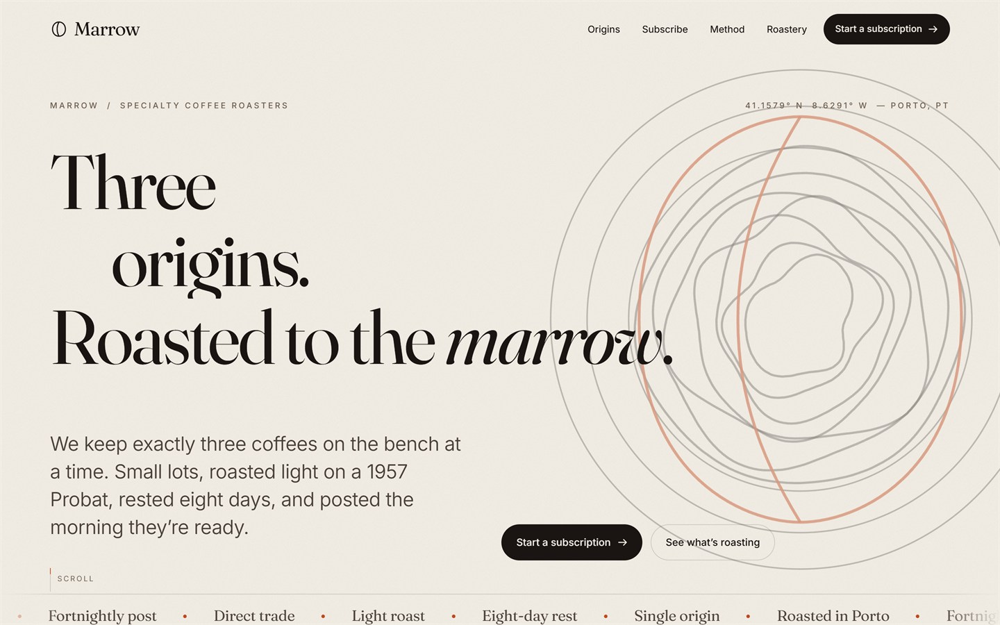

# Frontend Design

Landing pages taken from brief to something that actually runs — typography,
motion, WebGL and the code underneath. Each one is a complete concept: a brand,
a voice, and an interface idea carried all the way through, built as a single
self-contained document with no framework and no build step.

Every brief here was answered twice. `v1` and `v2` are independent designs
rather than drafts of each other — same client, same problem, two different
opinions about what the page should be. The pairs are the interesting part.

---

## 1 — Portfolio

### `v1` · Noor Abadi, Rotterdam

A designer's portfolio built like a technical drawing. After the headline
animates in, JavaScript measures the real bounding boxes of the type and draws
an SVG dimension diagram over it — height and width rules with tick caps, a
`gap 36` callout, a dashed baseline extension, live pixel labels. The whole
thing redraws on resize. Press `I` (or the button) for an inspect mode that
overlays a 12-column grid and stamps measured dimensions onto elements.

- **Signature** — the redline engine, and an inspect mode that treats the page as its own spec sheet
- **Background** — a Three.js raw-shader quad: simplex fBm warping a two-scale drafting grid, with drifting red guide lines that respond to pointer and scroll
- **Palette** — `#EDEAE3` paper, `#14130F` ink, `#FF4A1C` accent, over an SVG grain layer set to `multiply`
- **Type** — Bricolage Grotesque driven hard through `font-variation-settings`, Instrument Sans for body, DM Mono for labels
- **Craft** — three separate reduced-motion paths, a 4.5s failsafe plus a `window.error` listener so nothing can stay invisible, live Europe/Amsterdam clock

### `v2` · Solenne Riva, Lisbon

A dark gallery portfolio. Case studies are `position: sticky` cards that
physically recede into a deck — as the next card rises, ScrollTrigger scrubs the
outgoing one to `scale: .92` and `brightness(.55)`. The marquee reads scroll
velocity and applies a live `skewX`, so the type leans into the direction
you're scrolling.

- **Signature** — the sticky card deck, and velocity-driven skew on the marquee
- **Hero** — a simplex-displaced sphere with a Fresnel rim and 1,100 additive shader points; pointer *and* `deviceorientation` drive the rotation
- **Palette** — `#0B0B0C` ink, `#F2EFE7` bone, `#FF4A1C` acid, with a `#FFD166`/`#7DE2D1` gradient in the shader
- **Type** — Inter Tight, with Instrument Serif italic dropped inside sans headlines for emphasis
- **Craft** — the Three.js module is injected as a string after a WebGL probe, so a CDN failure cannot break the page; WAAPI fallback if GSAP never loads

---

## 2 — Marrow, a coffee roastery in Porto

### `v1` · Roasts as you scroll

The page is the roast. A single ScrollTrigger interpolates a nine-stop colour
ramp from bone to near-black and writes it into a `--tone` variable that drives
the whole background. Scroll is remapped so the ramp's midpoint lands exactly on
the "First crack" section. At 44% the ink inverts to cream — the flip point was
picked because both inks measure roughly 3.7:1 there. A fixed SVG roast curve
draws itself as you go, with a HUD reading live temperature, roast clock and
phase in Portuguese: *Secagem, Maillard, 1.ª fissura, Desenvolvimento, Drop*.

- **Signature** — scrolling the page roasts the coffee, colour and telemetry together
- **Palette** — `#EAE3D4` paper → `#17110C` ink, `#FF4A1C` ember; inverts to `#EFE7D8` ink past the crack
- **Type** — Instrument Serif display, Schibsted Grotesk body, DM Mono for the HUD and data tables
- **Craft** — reduced motion quantises the ramp to five steps; the background only repaints on 24 coarse steps; `theme-color` updates with the roast; the footer wordmark's viewBox is refit to real ink metrics measured on a canvas

### `v2` · Retinted by origin

Editorial and paper-first, with a dark section that changes colour depending on
which coffee you're looking at. Selecting an origin rewrites `--accent` to that
coffee's tasting note — apricot for Ethiopia, red plum for Colombia,
blackcurrant for Kenya — and because the token feeds a radial gradient with a
1.1s transition, the whole section bathes in it. The contour discs behind each
origin are generated procedurally: a seeded mulberry32 PRNG, Catmull-Rom
smoothing, labelled with growing altitude.

- **Signature** — origin tabs that retint an entire section; procedural topographic contours, one per coffee
- **Palette** — `#F4EFE6` paper, `#1A1512` ink, `#C4491F` ember, `#0C0A09` night; accent swapped per origin
- **Type** — Fraunces with `SOFT`/`WONK` axes engaged, Inter for body, both with metric-matched fallbacks using `size-adjust`
- **Zero libraries** — ~280 lines of vanilla JS hand-roll the scroll reveals, the word splitter, a full ARIA tablist with arrow keys and touch swipe, and a pricing pill that re-measures itself on `document.fonts.ready`

---

## 3 — Hearth, a generative audio engine

### `v1` · A fire that is also a spectrogram

Near-black, with a full-viewport ember field. The shader stretches its simplex
noise by `vec2(0.58, 2.30)` and multiplies it by a high-frequency sine term, so
the fire reads as drifting spectral strata rather than flame licks. Heat is
confined to the bottom of the frame; the pointer adds a soft blown coal; scroll
both sinks and cools it.

- **Signature** — noise deliberately distorted until fire looks like a spectrogram
- **Palette** — `#0E0D0B` ink, `#E8E4DC` ash, `#FF4A1C` ember
- **Type** — Instrument Serif up to 11rem, Schibsted Grotesk body, DM Mono specs
- **Craft** — reduced motion renders exactly one frame at `uTime = 21.0`; in-shader dither kills banding in the dark ramp; CSS radial-gradient fallback when WebGL is unavailable
- **Note** — no audio here; the sound is entirely visual metaphor

### `v2` · The ember actually listens

The one page that makes real sound. Nine oscillators sit on an A natural-minor
field between 110 and 440 Hz, detuned ±0.5%, through a lowpass modulated by a
0.045 Hz LFO. A scheduler fades one random voice in or out every 1.6–4.2
seconds, so it genuinely never repeats. An AnalyserNode feeds RMS into the
shader's `uLevel` uniform — the fire breathes with the pad it is playing.

- **Signature** — a WebGL2 ember driven by real amplitude from real synthesis, not a fake waveform
- **Palette** — `#07060A` ink, `#F4F0EA` paper, `#FF9A4D` ember; the source comments record measured contrast ratios (`8.2:1`, `5.1:1`) against the background
- **Type** — no webfonts at all; Iowan Old Style → Palatino → Georgia, with system sans and mono
- **Craft** — audio is strictly opt-in behind a button that stays hidden until an AudioContext exists, with an `aria-pressed` toggle and sr-only status; adaptive DPR governor with hysteresis; context-loss falls back to a CSS gradient

---

## The v1 / v2 split

The two versions of each brief were produced under different conditions — `v1`
with a design skill guiding the work, `v2` without it. The pages are worth
looking at on their own, but the pairs are also a rough comparison:

| File | Size | Lines | CDN deps | Libraries |
|---|---|---|---|---|
| `1-noor-abadi-v1` | 49.4 KB | 1073 | 8 | Three.js, GSAP, Lenis |
| `1-solenne-riva-v2` | 71.0 KB | 1457 | 3 | Three.js, GSAP |
| `2-marrow-v1` | 49.6 KB | 1244 | 5 | GSAP, Lenis |
| `2-marrow-v2` | 63.4 KB | 1446 | 0 | — |
| `3-hearth-v1` | 34.0 KB | 822 | 7 | Three.js, GSAP, Lenis |
| `3-hearth-v2` | 44.2 KB | 1176 | 0 | Web Audio API |

Every `v1` is 22–30% shorter than its `v2` counterpart, and leans on GSAP and
Lenis for motion. Every `v2` writes more of it by hand — two of them ship with
no external JavaScript at all. Which trade you prefer is the interesting
question; fewer dependencies is a real virtue, and so is not rewriting an easing
library.

---

## Stack

Plain HTML, CSS and JavaScript. Where libraries appear they are pinned:

- [Three.js](https://threejs.org/) — WebGL shader backgrounds
- [GSAP](https://gsap.com/) — animation, `ScrollTrigger`, `SplitText`, `CustomEase`
- [Lenis](https://lenis.darkroom.engineering/) — smooth scrolling
- Web Audio API — real synthesis in `3-hearth-v2.html`

Most pages pull fonts and libraries from a CDN. `3-hearth-v2.html` uses neither
— it renders complete and offline.

Screenshots in [`screenshots/`](screenshots) were captured at 1440×900 with
headless Chrome.

---

## License

[MIT](LICENSE) © 2026 Tomás Girão

Every person and business on these pages is invented. Noor Abadi, Solenne Riva,
Marrow and Hearth are not real, and the addresses, prices and credentials are
fiction written to make the briefs concrete.
