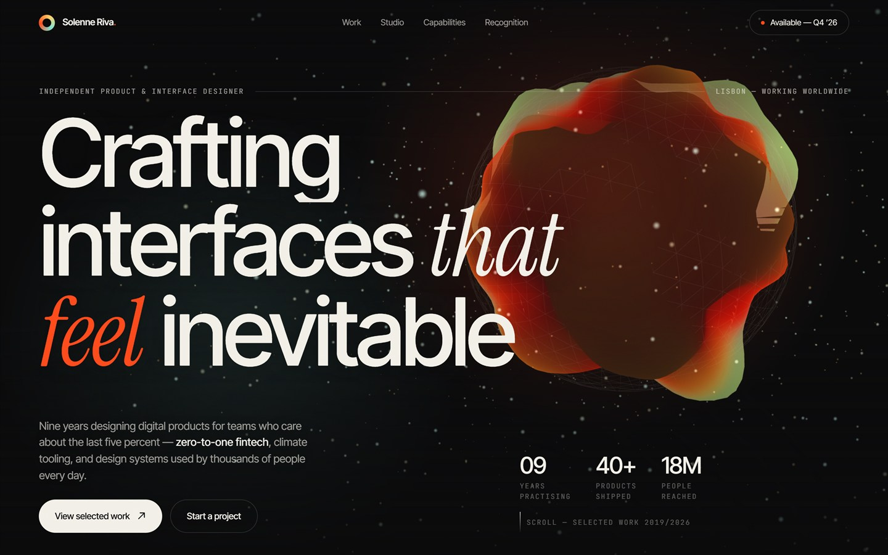
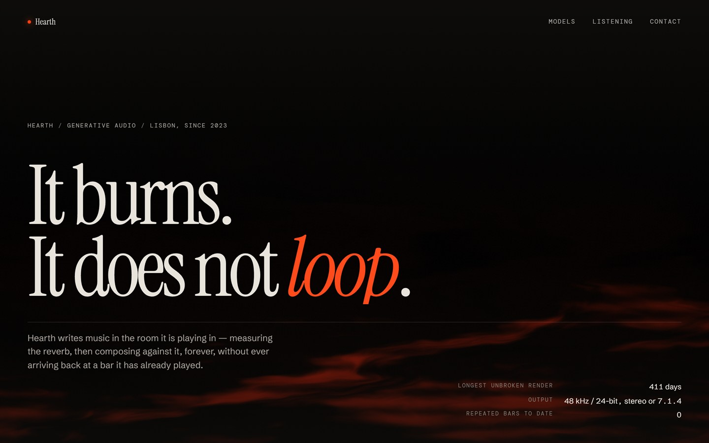
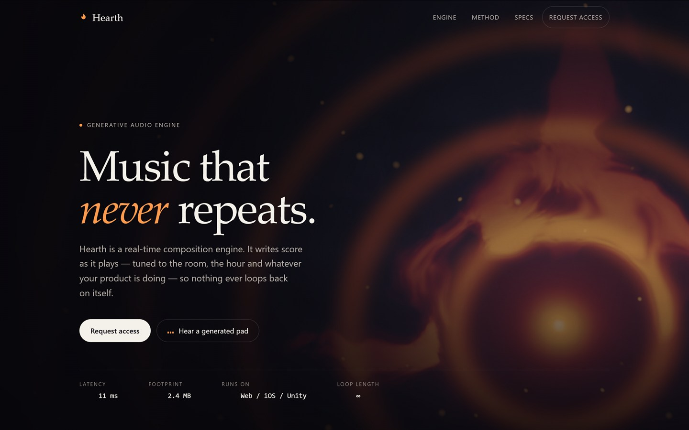
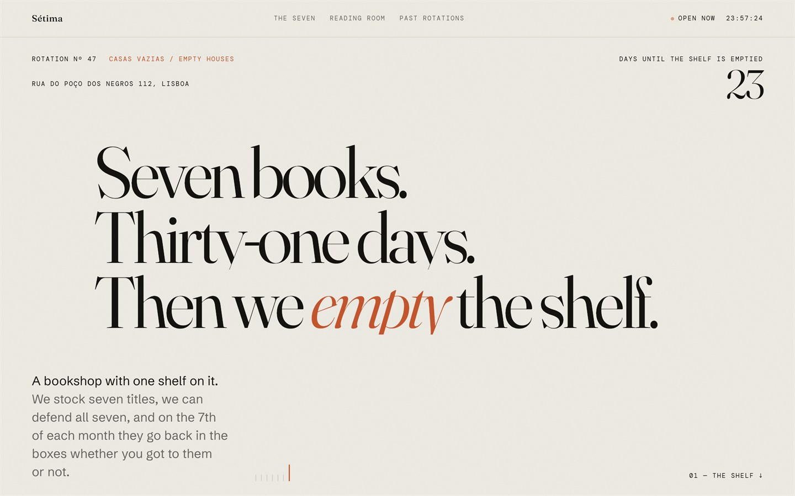
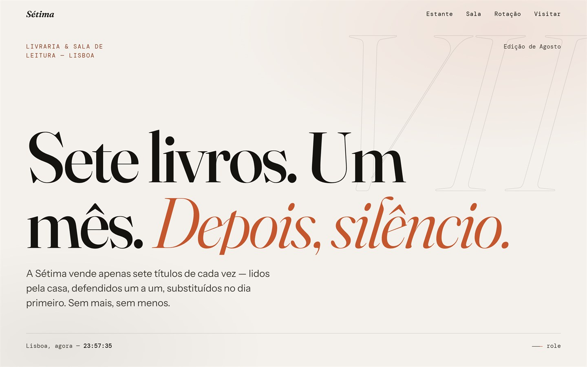
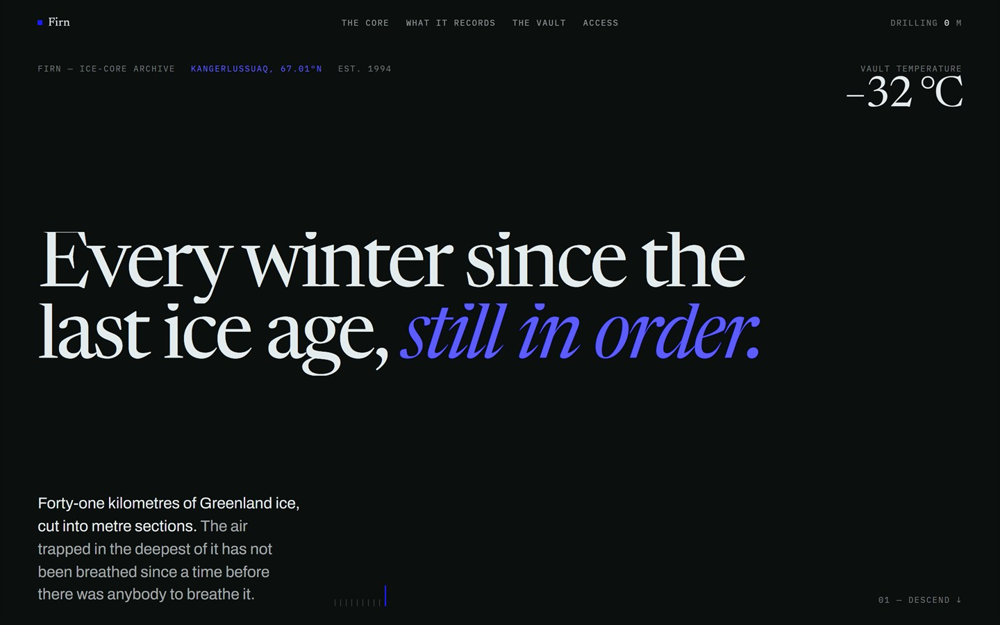
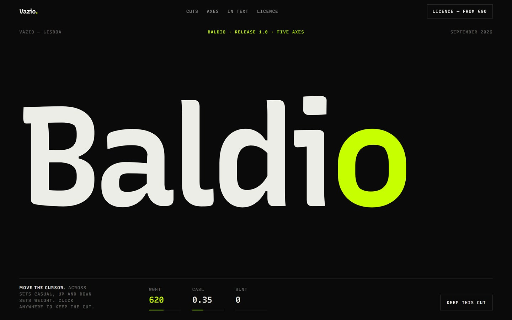

# Frontend Design

Landing pages taken from brief to something that actually runs — typography,
motion, WebGL and the code underneath. Each one is a complete concept: a brand,
a voice, and an interface idea carried all the way through, built as a single
self-contained document with no framework and no build step.

Some of the briefs were answered twice. Where a page carries a `v1` or `v2`
mark there is a companion answering the same brief a different way —
independent designs rather than drafts of each other, and the pairs are the
interesting part. The rest stand on their own.

---

## 1 — Noor Abadi, Rotterdam · `v1`

A designer's portfolio built like a technical drawing. After the headline
animates in, JavaScript measures the real bounding boxes of the type and draws
an SVG dimension diagram over it — height and width rules with tick caps, a
`gap 36` callout, a dashed baseline extension, live pixel labels. The whole
thing redraws on resize. Press `I` (or the button) for an inspect mode that
overlays a 12-column grid and stamps measured dimensions onto elements.

- **Signature** — the redline engine, and an inspect mode that treats the page as its own spec sheet
- **Background** — a Three.js raw-shader quad: simplex fBm warping a two-scale drafting grid, with drifting red guide lines that respond to pointer and scroll
- **Palette** — `#EDEAE3` paper, `#14130F` ink, `#FF4A1C` accent, over an SVG grain layer set to `multiply`
- **Type** — Bricolage Grotesque driven hard through `font-variation-settings`, Instrument Sans for body, DM Mono for labels
- **Craft** — three separate reduced-motion paths, a 4.5s failsafe plus a `window.error` listener so nothing can stay invisible, live Europe/Amsterdam clock

---

## 2 — Solenne Riva, Lisbon · `v2`

A dark gallery portfolio, and the companion piece to Noor Abadi above — same
brief, answered without the design skill guiding the work. Case studies are
`position: sticky` cards that physically recede into a deck — as the next card
rises, ScrollTrigger scrubs the outgoing one to `scale: .92` and
`brightness(.55)`. The marquee reads scroll velocity and applies a live
`skewX`, so the type leans into the direction you're scrolling.

- **Signature** — the sticky card deck, and velocity-driven skew on the marquee
- **Hero** — a simplex-displaced sphere with a Fresnel rim and 1,100 additive shader points; pointer *and* `deviceorientation` drive the rotation
- **Palette** — `#0B0B0C` ink, `#F2EFE7` bone, `#FF4A1C` acid, with a `#FFD166`/`#7DE2D1` gradient in the shader
- **Type** — Inter Tight, with Instrument Serif italic dropped inside sans headlines for emphasis
- **Craft** — the Three.js module is injected as a string after a WebGL probe, so a CDN failure cannot break the page; WAAPI fallback if GSAP never loads

---

## 3 — Marrow, a coffee roastery in Porto

### `v1` · Roasts as you scroll

The page is the roast. A single ScrollTrigger interpolates a nine-stop colour
ramp from bone to near-black and writes it into a `--tone` variable that drives
the whole background. Scroll is remapped so the ramp's midpoint lands exactly on
the "First crack" section. At 44% the ink inverts to cream — the flip point was
picked because both inks measure roughly 3.7:1 there. A fixed SVG roast curve
draws itself as you go, with a HUD reading live temperature, roast clock and
phase in Portuguese: *Secagem, Maillard, 1.ª fissura, Desenvolvimento, Drop*.

- **Signature** — scrolling the page roasts the coffee, colour and telemetry together
- **Palette** — `#EAE3D4` paper → `#17110C` ink, `#FF4A1C` ember; inverts to `#EFE7D8` ink past the crack
- **Type** — Instrument Serif display, Schibsted Grotesk body, DM Mono for the HUD and data tables
- **Craft** — reduced motion quantises the ramp to five steps; the background only repaints on 24 coarse steps; `theme-color` updates with the roast; the footer wordmark's viewBox is refit to real ink metrics measured on a canvas

### `v2` · Retinted by origin

Editorial and paper-first, with a dark section that changes colour depending on
which coffee you're looking at. Selecting an origin rewrites `--accent` to that
coffee's tasting note — apricot for Ethiopia, red plum for Colombia,
blackcurrant for Kenya — and because the token feeds a radial gradient with a
1.1s transition, the whole section bathes in it. The contour discs behind each
origin are generated procedurally: a seeded mulberry32 PRNG, Catmull-Rom
smoothing, labelled with growing altitude.

- **Signature** — origin tabs that retint an entire section; procedural topographic contours, one per coffee
- **Palette** — `#F4EFE6` paper, `#1A1512` ink, `#C4491F` ember, `#0C0A09` night; accent swapped per origin
- **Type** — Fraunces with `SOFT`/`WONK` axes engaged, Inter for body, both with metric-matched fallbacks using `size-adjust`
- **Zero libraries** — ~280 lines of vanilla JS hand-roll the scroll reveals, the word splitter, a full ARIA tablist with arrow keys and touch swipe, and a pricing pill that re-measures itself on `document.fonts.ready`

---

## 4 — Hearth, a generative audio engine

### `v1` · A fire that is also a spectrogram

Near-black, with a full-viewport ember field. The shader stretches its simplex
noise by `vec2(0.58, 2.30)` and multiplies it by a high-frequency sine term, so
the fire reads as drifting spectral strata rather than flame licks. Heat is
confined to the bottom of the frame; the pointer adds a soft blown coal; scroll
both sinks and cools it.

- **Signature** — noise deliberately distorted until fire looks like a spectrogram
- **Palette** — `#0E0D0B` ink, `#E8E4DC` ash, `#FF4A1C` ember
- **Type** — Instrument Serif up to 11rem, Schibsted Grotesk body, DM Mono specs
- **Craft** — reduced motion renders exactly one frame at `uTime = 21.0`; in-shader dither kills banding in the dark ramp; CSS radial-gradient fallback when WebGL is unavailable
- **Note** — no audio here; the sound is entirely visual metaphor

### `v2` · The ember actually listens

The one page that makes real sound. Nine oscillators sit on an A natural-minor
field between 110 and 440 Hz, detuned ±0.5%, through a lowpass modulated by a
0.045 Hz LFO. A scheduler fades one random voice in or out every 1.6–4.2
seconds, so it genuinely never repeats. An AnalyserNode feeds RMS into the
shader's `uLevel` uniform — the fire breathes with the pad it is playing.

- **Signature** — a WebGL2 ember driven by real amplitude from real synthesis, not a fake waveform
- **Palette** — `#07060A` ink, `#F4F0EA` paper, `#FF9A4D` ember; the source comments record measured contrast ratios (`8.2:1`, `5.1:1`) against the background
- **Type** — no webfonts at all; Iowan Old Style → Palatino → Georgia, with system sans and mono
- **Craft** — audio is strictly opt-in behind a button that stays hidden until an AudioContext exists, with an `aria-pressed` toggle and sr-only status; adaptive DPR governor with hysteresis; context-loss falls back to a CSS gradient

---

## 5 — Sétima, a bookshop in Lisbon

A shop that stocks seven titles and empties the shelf every month. Both versions
found the same terracotta (`#C4562E`) and the same Fraunces display face without
being told to, and both invented an eighth book that is never for sale.

### `v1` · The shelf opens like a book

Seven vertical spines fill the viewport, titles set in `writing-mode: vertical-rl`.
Scrolling a pinned section drives one spine from 7.6% to 54.4% width while the
rest compress, and a single detail panel is physically `appendChild`-ed into
whichever spine is open — one element moved through the shelf rather than seven
panels toggling. It wipes in on `clip-path` with the copy staggered behind it.

- **Signature** — the accordion shelf, and the fact that only one plate exists in the DOM at any moment
- **Fallback with an idea in it** — on mobile the shelf becomes a stack where each entry's rule is drawn from its real page count (`--pp: 232` → a bar 31px tall), so a short book looks short. The spine metaphor survives the breakpoint instead of being dropped.
- **Palette** — `#14130F` ink, `#EDEAE3` paper, `#C4562E` terracotta
- **Type** — Fraunces with `WONK 1` and `opsz` retuned per role (24 for the wordmark, 144 for the masthead), Schibsted Grotesk, DM Mono
- **Craft** — a seven-tick rule in the masthead with only the last one lit; days-until-the-7th computed live; pressing `7` scrolls you to the seventh spine, and the footer just says `Press 7`

### `v2` · Seven cards and a deliberate gap

Written in Portuguese, and warmer — an outlined `VII` sits behind the masthead
and the shelf runs as a horizontal scrub through eight cards. The eighth is a
dashed ghost that is permanently empty: *"O oitavo lugar fica sempre vazio — para
o livro que ainda ninguém escreveu."* Scroll past 97% and the counter stops
reading `de 07` and admits `o oitavo lugar fica vazio`.

- **Signature** — the empty eighth card, which turns a shop constraint into the page's best line
- **Palette** — `#F4F1EC` paper, `#14130F` ink, `#C4562E` accent, with per-book spine colours
- **Type** — Fraunces italic for display, Instrument Sans for body, DM Mono for labels
- **Craft** — the header detects when it is over a dark section and inverts; the edition label builds itself from the current month in `pt-PT`; a countdown runs to midnight on the 1st; the footer hides one more line — *Há sempre um oitavo livro. Nunca à venda.*

---

## 6 — Firn, an ice-core archive in Greenland

The page *is* the core sample. A pinned column of Greenland ice runs behind a
fixed cut line, and scrolling drills: depth climbs toward 3,040 m, the year at
the cut runs backwards past 89,000 BCE, and the CO₂ in the trapped air follows
the glacial saw-tooth down with it. The ice is drawn, not photographed —
annual layers start a fingernail thick and compress to hairlines under their
own weight, going from pale firn to dense blue as the depth-to-age curve steepens.
Dated markers travel up past the cut as you go: Tambora 1815, the 1963 weapons
fallout, Roman smelting lead, Thera.

- **Signature** — one continuous column, one scrub; the readouts are computed from the depth rather than keyframed
- **Palette** — `#0B0F0E` ink, `#E3EBED` ice, Klein blue `#1B1BFF` — the first page here with no warm accent at all
- **Type** — Newsreader for display, Archivo for text, IBM Plex Mono for the instrument readouts
- **Craft** — depth→age is a fourth-power curve, so a metre near the surface is two years and a metre near the bed is several thousand; reduced motion unpins the core and stands it up as a static specimen column rather than freezing it
- **No WebGL** — the whole core is `hsl()` bands generated from a seeded PRNG

---

## 7 — Baldio, a variable typeface from Vazio

A foundry release page set entirely in the face it is selling — no second
family anywhere. The eyebrows, the axis readouts and the tabular numbers are
the same typeface with its `MONO` axis pushed to 1, which is both the cheapest
possible proof that the axis works and the reason the page needs nothing else.
The specimen word tracks the cursor on two axes at once: across sets `CASL`,
up and down sets `wght`, with the live coordinates printed beneath. Click and
the current cut is stamped into a running spec sheet below.

- **Signature** — the cursor is the axis slider, and the page keeps a record of every cut you liked
- **Palette** — `#0A0A0A` ink, `#EDEDE8` bone, acid lime `#C8FF00`
- **Type** — one family, five axes, every role derived from it
- **Craft** — axes are lerped toward a target each frame rather than set directly, so the word settles instead of snapping; touch devices get the axes driven by scroll instead of a cursor they do not have; reduced motion parks the specimen on the release cut
- **Copy** — the licence is a flat price with no renewal and no phone-home, which is the actual argument the page is making

---

## The v1 / v2 split

Briefs 1–5 were each produced twice under different conditions — `v1` with a
design skill guiding the work, `v2` without it. Firn and Baldio are not part of
that and are absent from the table below. The pages are worth looking at on
their own, but the pairs are also a rough comparison:

| File | Size | Lines | CDN deps | Libraries |
|---|---|---|---|---|
| `1-noor-abadi-v1` | 49.4 KB | 1073 | 8 | Three.js, GSAP, Lenis |
| `2-solenne-riva-v2` | 71.0 KB | 1457 | 3 | Three.js, GSAP |
| `3-marrow-v1` | 49.6 KB | 1244 | 5 | GSAP, Lenis |
| `3-marrow-v2` | 63.4 KB | 1446 | 0 | — |
| `4-hearth-v1` | 34.0 KB | 822 | 7 | Three.js, GSAP, Lenis |
| `4-hearth-v2` | 44.2 KB | 1176 | 0 | Web Audio API |
| `5-setima-v1` | 42.2 KB | 1057 | 6 | GSAP, Lenis |
| `5-setima-v2` | 38.4 KB | 900 | 5 | GSAP, Lenis |

For the first three briefs the pattern was clean: `v1` came out 22–30% shorter
and leaned on GSAP and Lenis, while `v2` hand-rolled the same behaviour and
twice shipped with no external JavaScript at all.

Sétima breaks it. There `v1` is the *longer* of the two, and both versions reach
for the same libraries. One inversion in four says more than the three that
agreed — whichever way the trade tends to fall, it is a tendency and not a rule.

---

## Stack

Plain HTML, CSS and JavaScript. Where libraries appear they are pinned:

- [Three.js](https://threejs.org/) — WebGL shader backgrounds
- [GSAP](https://gsap.com/) — animation, `ScrollTrigger`, `SplitText`, `CustomEase`
- [Lenis](https://lenis.darkroom.engineering/) — smooth scrolling
- Web Audio API — real synthesis in `4-hearth-v2.html`

Most pages pull fonts and libraries from a CDN. `4-hearth-v2.html` uses neither
— it renders complete and offline.

Screenshots in [`screenshots/`](screenshots) were captured at 1440×900 with
headless Chrome.

---

## License

**MIT** © 2026 Tomás Girão — see [LICENSE](LICENSE). Anyone may use, copy, modify and share these pages freely.

Every person and business on these pages is invented. Noor Abadi, Solenne Riva,
Marrow, Hearth, Sétima and its bookseller Inês Mourão, Firn and the Vazio
foundry are not real, and the addresses, prices and credentials are fiction
written to make the briefs concrete. Some of the material inside them is not:
the books on Sétima's shelf are real books, and the eruptions, fallout layers
and Roman lead in Firn are real markers that real ice cores actually record.
Firn's own holdings are made up. Baldio is set in Recursive, standing in for a
typeface that does not exist.
